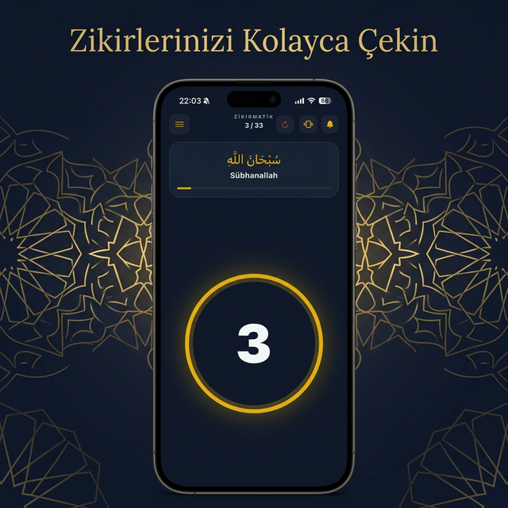
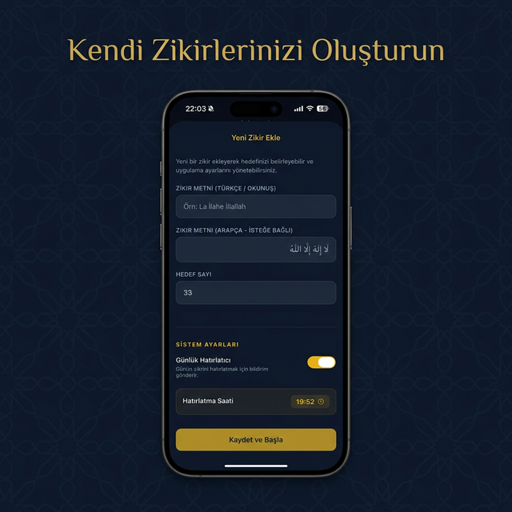
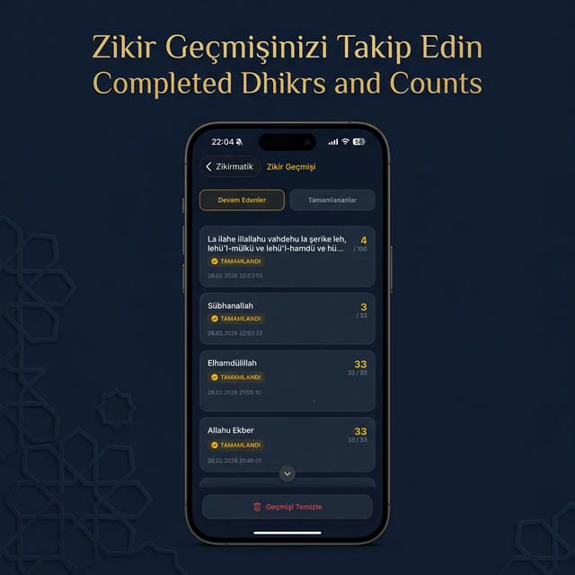

<p align="center">
  
</p>

# Zikirmatik - Modern Dijital Tesbih

[](https://github.com/eminaydin/zikirmatik)

Zikirmatik, manevi yolculuğunuzda size eşlik etmek için tasarlanmış, modern ve kullanımı kolay bir dijital tesbih uygulamasıdır. Sade tasarımı ve premium kullanıcı deneyimi ile zikirlerinizi her an, her yerde takip edebilirsiniz.

[English Version Below](#english)

---

## 📸 Ekran Görüntüleri

| Ana Ekran | Öneriler | Yeni Zikir | Geçmiş |
| :---: | :---: | :---: | :---: |
|  |  |  |  |

---

## 🕊️ Neden Zikirmatik?

Zikir çekerken araya giren, maneviyatı ve odaklanmayı bozan gereksiz reklamlardan rahatsız olduğum için bu uygulamayı geliştirdim. 

Zikirmatik **tamamen ücretsizdir** ve her zaman öyle kalacaktır. Uygulamamız **hiçbir şekilde kişisel veri toplamaz, kullanmaz ve hiçbir zaman da kullanmayacaktır.** Sizin de huzur içinde zikir çekebilmeniz için reklamsız, sade ve güvenli bir deneyim sunmaya devam edeceğiz.

---

## ✨ Özellikler

- **📱 Modern Tasarım:** Minimalist ve göz yormayan, premium bir arayüz.
- **📚 Zengin Kütüphane:** Hazır zikir önerileri ile hemen başlayın.
- **➕ Özel Zikirler:** Kendi zikirlerinizi ve hedeflerinizi oluşturun.
- **📊 Gelişmiş Geçmiş:** Çektiğiniz tüm zikirleri tarihlerine göre takip edin.
- **📳 Haptik Geri Bildirim:** Her sayımda gerçek bir tesbih hissi veren dokunsal geri bildirim.
- **🌐 Çevrimdışı Çalışma:** İnternete bağlı olmasanız bile verileriniz cihazınızda güvenle saklanır.

## 🛠️ Kullanılan Teknolojiler

- **Framework:** Expo & React Native
- **Dil:** TypeScript
- **Depolama:** AsyncStorage

## 🚀 Kurulum 

Projeyi yerel olarak çalıştırmak isterseniz:

1. Depoyu klonlayın:
   ```bash
   git clone https://github.com/eminaydin/zikirmatik.git
   ```
2. Gerekli paketleri kurun:
   ```bash
   npm install
   ```
3. Uygulamayı başlatın:
   ```bash
   npx expo start
   ```

## 📄 Gizlilik Politikası

Kullanıcı gizliliğine önem veriyoruz. Uygulamamız hiçbir şekilde kişisel veri toplamaz. Detaylı politikaya [buradan](PRIVACY_POLICY.md) ulaşabilirsiniz.

## 🤝 Destek

Bir sorunla karşılaştıysanız veya öneriniz varsa lütfen [Issues](https://github.com/eminaydin/zikirmatik/issues) kısmından bildirin.

---

<a name="english"></a>
# Zikirmatik - Modern Digital Tasbih

Zikirmatik is a modern and easy-to-use digital tasbih application designed to accompany you on your spiritual journey.

## 📸 Screenshots

*(See imagery in the section above)*

## 🕊️ Why Zikirmatik?

I developed this app because I was frustrated with annoying ads that disrupt spiritual focus during dhikr.

Zikirmatik is **completely free** and will always remain so. Our app **does not collect or use your personal data in any way, nor will it ever.** We will continue to provide an ad-free, simple, and secure experience so you can focus on your spirituality in peace.

## ✨ Features

- **📱 Modern Design:** A minimalist and eye-pleasing premium interface.
- **📚 Rich Library:** Start immediately with ready-made dhikr suggestions.
- **➕ Custom Dhikrs:** Create your own dhikrs and goals.
- **📊 Advanced History:** Track all your dhikrs by date.
- **📳 Haptic Feedback:** Tactile feedback that gives the feeling of a real tasbih.
- **🌐 Offline Mode:** Your data is stored securely on your device even without an internet connection.

## 📄 Privacy Policy

We value user privacy. Our app does not collect any personal data. You can access the detailed policy [here](PRIVACY_POLICY.md).

## 🤝 Support

If you encounter any issues or have suggestions, please report them via [Issues](https://github.com/eminaydin/zikirmatik/issues).

---

© 2026 Emin Aydın. Tüm hakları saklıdır.
